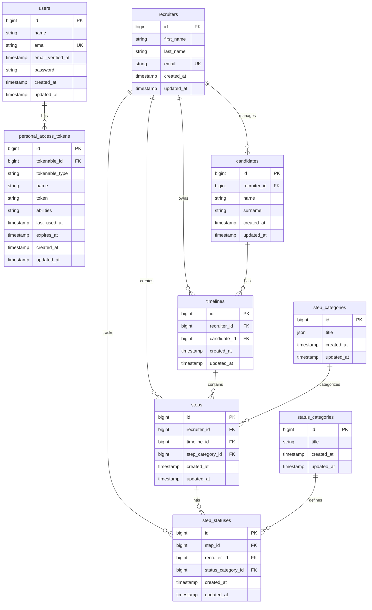

# Timeline Assessment API

A Laravel-based REST API for managing recruitment timelines, tracking candidate progress through various interview steps and status updates.

## Technology Stack

- **Laravel 12** - PHP web framework
- **Laravel Sail** - Docker-based development environment
- **MySQL 8.4** - Database
- **Laravel Sanctum** - API authentication
- **Docker** - Containerization

## Database Schema

The following diagram illustrates the database structure and relationships:



**Key Relationships:**
- A **Recruiter** manages multiple **Candidates** and owns multiple **Timelines**
- A **Candidate** can have multiple **Timelines** (different recruitment processes)
- A **Timeline** contains multiple **Steps** (e.g., 1st Interview, Tech Assessment)
- Each **Step** belongs to a **StepCategory** and can have multiple **StepStatuses** (status history)
- Each **StepStatus** references a **StatusCategory** (Pending, Complete, Reject)
- **Steps** have a unique constraint: one step category per timeline
- All relationships use cascade delete for data integrity

## Prerequisites

Before you begin, ensure you have the following installed:

- **Docker Desktop** - Must be installed and running
- **Git** - For cloning the repository
- Basic knowledge of Laravel and REST APIs

## Installation & Setup

Follow these steps to set up the application:

### 1. Clone the Repository

```bash
git clone git@github.com:The20PerCentYouNeed/timeline-assessment.git
cd timeline-assessment
```

### 2. Configure Environment

```bash
cp .env.example .env
```

**Important Environment Variables:**

If you have other services running on the default ports, you may need to configure the following variables in your `.env` file:

- `APP_PORT=8080` - The port on which the Laravel application will be accessible. Set this if port 80 is already in use.
- `FORWARD_DB_PORT=3307` - The port on your host machine that forwards to MySQL inside the container. Set this if port 3306 is already in use.

**Example `.env` configuration:**

```env
APP_PORT=8080
FORWARD_DB_PORT=3307
APP_URL=http://localhost:8080
```

These settings allow the application to run alongside other services without port conflicts.

### 3. Install Dependencies

```bash
composer install
```

### 4. Generate Application Key

```bash
php artisan key:generate
```

### 5. Start Docker Containers

```bash
sail up -d
```

This command starts the Laravel application and MySQL database containers in detached mode.

### 6. Run Database Migrations and Seeders

```bash
sail artisan migrate --seed
```

This will:
- Create all necessary database tables
- Seed the database with initial data including:
  - A test user (email: `test@example.com`)
  - Sample recruiters
  - Step categories (1st Interview, Tech Assessment, Other)
  - Status categories (Pending, Complete, Reject)

### 7. Generate API Token for Testing

To authenticate API requests, you need to generate a personal access token:

```bash
sail artisan tinker
```

Once in the Tinker shell, execute:

```php
User::first()->createToken('api-token')->plainTextToken;
```

Copy the returned token. You'll use this token in the `Authorization` header for all API requests.

## API Documentation

All API endpoints require authentication via Laravel Sanctum. Include the token in the `Authorization` header:

```
Authorization: Bearer {your-token-here}
```

**Base URL:** `http://localhost:8080` (or your configured `APP_URL`)

All responses follow Laravel's Resource pattern and are wrapped in a `data` key.

---

### 1. Get Timeline

Retrieve a timeline with all its associated steps and current statuses.

**Endpoint:** `GET /api/timelines/{timeline}`

**Authentication:** Required

**Parameters:**
- `timeline` (path parameter) - The ID of the timeline to retrieve

**Response Structure:**

```json
{
  "data": {
    "id": 1,
    "recruiter_id": 1,
    "candidate_id": 1,
    "created_at": "2025-12-23T10:00:00.000000Z",
    "updated_at": "2025-12-23T10:00:00.000000Z",
    "steps": [
      {
        "id": 1,
        "recruiter_id": 1,
        "timeline_id": 1,
        "step_category_id": 1,
        "created_at": "2025-12-23T10:05:00.000000Z",
        "updated_at": "2025-12-23T10:05:00.000000Z",
        "current_status": {
          "id": 1,
          "step_id": 1,
          "recruiter_id": 1,
          "status_category_id": 1,
          "created_at": "2025-12-23T10:05:00.000000Z",
          "updated_at": "2025-12-23T10:05:00.000000Z"
        }
      }
    ]
  }
}
```

**Example Request:**

```bash
curl -X GET "http://localhost:8080/api/timelines/1" \
  -H "Authorization: Bearer {your-token}" \
  -H "Accept: application/json"
```

---

### 2. Create Timeline

Create a new timeline and candidate record. The candidate is automatically created.

**Endpoint:** `POST /api/timelines`

**Authentication:** Required

**Request Body:**

```json
{
  "recruiter_id": 1,
  "candidate_name": "John",
  "candidate_surname": "Doe"
}
```

**Field Validation:**
- `recruiter_id` (required) - Must exist in the `recruiters` table
- `candidate_name` (required) - String, maximum 255 characters
- `candidate_surname` (required) - String, maximum 255 characters

**Response Structure:**

```json
{
  "data": {
    "id": 1,
    "recruiter_id": 1,
    "candidate_id": 1,
    "created_at": "2025-12-23T10:00:00.000000Z",
    "updated_at": "2025-12-23T10:00:00.000000Z",
    "steps": []
  }
}
```

**Example Request:**

```bash
curl -X POST "http://localhost:8080/api/timelines" \
  -H "Authorization: Bearer {your-token}" \
  -H "Accept: application/json" \
  -H "Content-Type: application/json" \
  -d '{
    "recruiter_id": 1,
    "candidate_name": "John",
    "candidate_surname": "Doe"
  }'
```

**Note:** This endpoint automatically creates a new candidate record if one doesn't exist for the specified recruiter.

---

### 3. Create Step

Add a new step to an existing timeline. Each step represents a stage in the recruitment process (e.g., "1st Interview", "Tech Assessment").

**Endpoint:** `POST /api/timelines/{timeline}/steps`

**Authentication:** Required

**Parameters:**
- `timeline` (path parameter) - The ID of the timeline to add the step to

**Request Body:**

```json
{
  "candidate_id": 1,
  "recruiter_id": 1,
  "step_category_id": 1,
  "status_category_id": 1
}
```

**Field Validation:**
- `candidate_id` (required) - Must exist in the `candidates` table
- `recruiter_id` (required) - Must exist in the `recruiters` table
- `step_category_id` (required) - Must exist in the `step_categories` table
- `status_category_id` (required) - Must exist in the `status_categories` table

**Business Rules:**
- The timeline must belong to the specified candidate
- The timeline must belong to the specified recruiter
- The candidate must belong to the specified recruiter
- Each step category can only exist once per timeline (uniqueness enforced)

**Response Structure:**

```json
{
  "data": {
    "id": 1,
    "recruiter_id": 1,
    "timeline_id": 1,
    "step_category_id": 1,
    "created_at": "2025-12-23T10:05:00.000000Z",
    "updated_at": "2025-12-23T10:05:00.000000Z",
    "current_status": {
      "id": 1,
      "step_id": 1,
      "recruiter_id": 1,
      "status_category_id": 1,
      "created_at": "2025-12-23T10:05:00.000000Z",
      "updated_at": "2025-12-23T10:05:00.000000Z"
    }
  }
}
```

**Example Request:**

```bash
curl -X POST "http://localhost:8080/api/timelines/1/steps" \
  -H "Authorization: Bearer {your-token}" \
  -H "Accept: application/json" \
  -H "Content-Type: application/json" \
  -d '{
    "candidate_id": 1,
    "recruiter_id": 1,
    "step_category_id": 1,
    "status_category_id": 1
  }'
```

**Note:** Creating a step automatically creates an initial status record with the provided `status_category_id`.

---

### 4. Create Step Status

Add a status update to an existing step. This allows tracking the progression of a step through different statuses (e.g., Pending → Complete).

**Endpoint:** `POST /api/steps/{step}/statuses`

**Authentication:** Required

**Parameters:**
- `step` (path parameter) - The ID of the step to add a status to

**Request Body:**

```json
{
  "candidate_id": 1,
  "recruiter_id": 1,
  "timeline_id": 1,
  "status_category_id": 2
}
```

**Field Validation:**
- `candidate_id` (required) - Must exist in the `candidates` table
- `recruiter_id` (required) - Must exist in the `recruiters` table
- `timeline_id` (required) - Must exist in the `timelines` table
- `status_category_id` (required) - Must exist in the `status_categories` table

**Business Rules:**
- The step must belong to the specified timeline
- The timeline must belong to the specified candidate
- The step must belong to the specified recruiter

**Response Structure:**

```json
{
  "id": 2,
  "step_id": 1,
  "recruiter_id": 1,
  "status_category_id": 2,
  "created_at": "2025-12-23T10:10:00.000000Z",
  "updated_at": "2025-12-23T10:10:00.000000Z"
}
```

**Example Request:**

```bash
curl -X POST "http://localhost:8080/api/steps/1/statuses" \
  -H "Authorization: Bearer {your-token}" \
  -H "Accept: application/json" \
  -H "Content-Type: application/json" \
  -d '{
    "candidate_id": 1,
    "recruiter_id": 1,
    "timeline_id": 1,
    "status_category_id": 2
  }'
```

**Note:** Each status update is added to the step's status history. The most recent status is considered the "current status" when retrieving timeline data.

---

## Example Data

The database seeder populates the following reference data:

### Recruiters

The following recruiters are created by default:

- Sarah Johnson (`sarah.johnson@recruitment.com`)
- Michael Chen (`michael.chen@recruitment.com`)
- Emily Rodriguez (`emily.rodriguez@recruitment.com`)
- David Williams (`david.williams@recruitment.com`)
- Jessica Martinez (`jessica.martinez@recruitment.com`)

### Step Categories

Available step categories for recruitment stages:

- **1st Interview** - Initial interview stage
- **Tech Assessment** - Technical evaluation
- **Other** - Additional stages

### Status Categories

Available status values for tracking step progress:

- **Pending** - Step is awaiting action
- **Complete** - Step has been completed
- **Reject** - Step has been rejected

---

## Authentication

This API uses **Laravel Sanctum** for token-based authentication. All endpoints require a valid authentication token.

### Generating an API Token

1. Start the Tinker console:

```bash
sail artisan tinker
```

2. Generate a token for the first user:

```php
User::first()->createToken('api-token')->plainTextToken;
```

3. Copy the returned token string.

### Using the Token

Include the token in the `Authorization` header of all API requests:

```
Authorization: Bearer {your-token-here}
```

**Example:**

```bash
curl -X GET "http://localhost:8080/api/timelines/1" \
  -H "Authorization: Bearer 1|abcdef123456..." \
  -H "Accept: application/json"
```

### Test User

The database seeder creates a default test user:
- **Email:** `test@example.com`
- **Name:** Test User

You can use this user to generate your API token for testing purposes.

---

## Error Responses

The API returns standard HTTP status codes:

- **200 OK** - Successful GET request
- **201 Created** - Successful POST request
- **401 Unauthorized** - Missing or invalid authentication token
- **422 Unprocessable Entity** - Validation errors

**Example Error Response:**

```json
{
  "message": "The given data was invalid.",
  "errors": {
    "recruiter_id": [
      "The recruiter id field is required."
    ],
    "candidate_name": [
      "The candidate name field is required."
    ]
  }
}
```

---

## Development

### Running Tests

```bash
sail artisan test
```

### Accessing the Application

Once the containers are running, the application is available at:

- **Application:** `http://localhost:8080` (or your configured `APP_URL`)
- **API Base URL:** `http://localhost:8080/api`

**Note:** If you've configured `APP_PORT` to a different value (e.g., `8080`), make sure your `APP_URL` in `.env` matches the port configuration.

### Stopping Containers

```bash
sail down
```

To stop and remove volumes:

```bash
sail down -v
```

---

## License

This project is open-sourced software licensed under the [MIT license](https://opensource.org/licenses/MIT).
